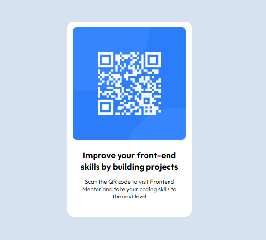

# Frontend Mentor - QR code component solution

This is a solution to the [QR code component challenge on Frontend Mentor](https://www.frontendmentor.io/challenges/qr-code-component-iux_sIO_H). Frontend Mentor challenges help you improve your coding skills by building realistic projects. 

## Table of contents

- [Overview](#overview)
  - [Screenshot](#screenshot)
  - [Links](#links)
- [My process](#my-process)
  - [Built with](#built-with)
  - [What I learned](#what-i-learned)
  - [Continued development](#continued-development)
- [Author](#author)

## Overview

### Screenshot



### Links

- Solution URL: [Add solution URL here](https://your-solution-url.com)
- Live Site URL: [Add live site URL here](https://your-live-site-url.com)

## My process

### Built with

- Semantic HTML5 markup
- CSS custom properties
- Flexbox

### What I learned

Hi! So this was a very simple exercise solution that I made. That was actually the first project that I did all by myself, so I ended up very satisfied with the results.
I didn't learned anything new, but was nice to see that I was able to aplie some the things that I learned. But, I almost forgot how to align the text, so I strugled a little with that especific part that only needed to have the following solution:

```css
.qr-code .title {
    text-align: center;
}
```
For this project, was only that! Thank for reading until here.

### Continued development

I still feel like I need to learn more how to apllie flexbox or grid (this least wasan't used on this project), so I will keep my focus on learning that for now.

## Author

- Website - [Add your name here](https://www.your-site.com)
- Frontend Mentor - [@yourusername](https://www.frontendmentor.io/profile/yourusername)
